# Router-Log-Analysis
Analysing Simluated Router Logs from fabricated scenarios of common Attacks possible on a household. Part of Digital Forensics and Investigation Activity. 

The intention behind this activity was to learn and analyse how different attacks can be inferred from just the logs of a router. I couldnt find real logs for this, and so we were instructed to create the data. I tried the best that I could. There are certainly many inaccuracies and even straight up mistakes in this analysis, but it is meant only to get the point across, which I believe it does. I apologise however for the probably inaccuracy that you may find in this data. Do not take it as is, as a credible source of information, it is only for educational purposes. This would have been authentic if we could find router logs and perform attacks on them, but we couldnt so, this here is the best that we could do. 

Given the fact that it was an analysis activity either way, the focus here has been on just demonstrating the attacks, and try to prettify the graphs created using python and matplotilb. 

# For a Detailed Report, check out [The Assignment Report](./Assignment_2.pdf)

# Analysis Conducted. 

## Normal Usage Data

### Interface Usage - Normal Usage

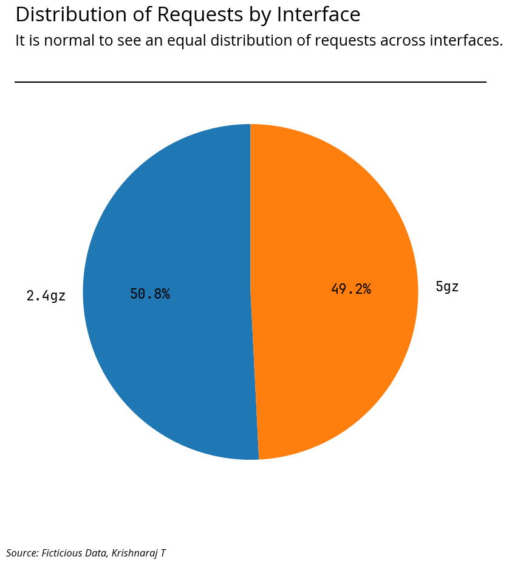

## DOS Attack Data

### Devices Connected - Normal Usage

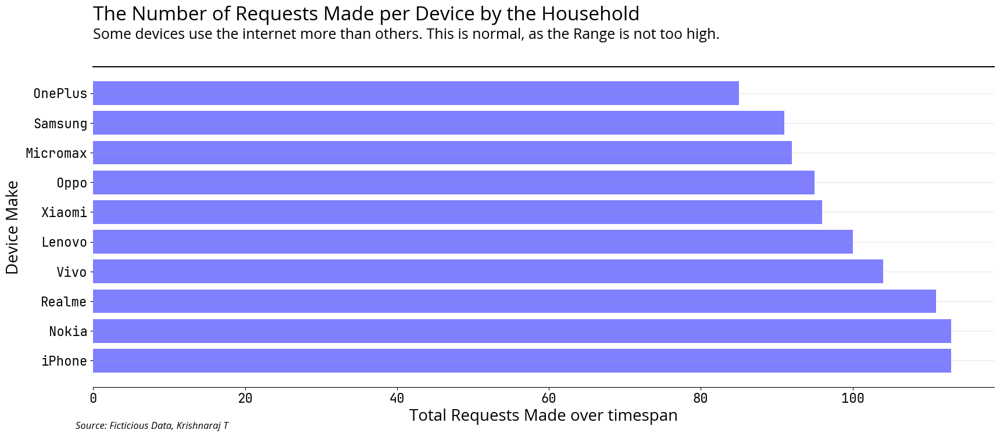

### IP Addresses Connected - DOS Attack

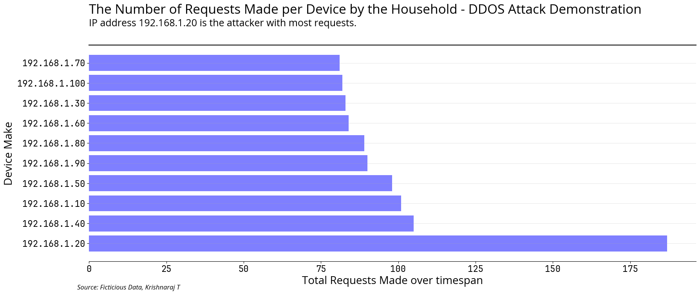

### Hourly Usage - Normal Usage

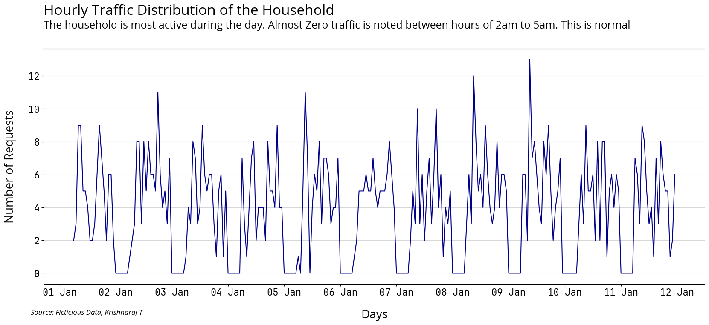

### Hourly Usage - Normal Usage

!

### Protocols Used - Normal Usage

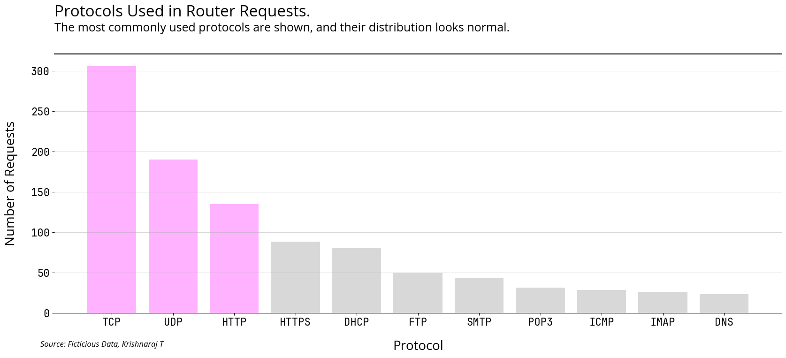

### Protocol Usage - DOS Attack

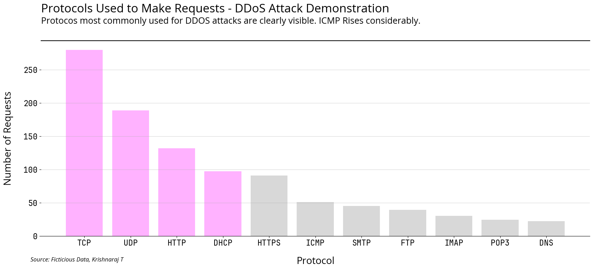

### Daily Usage - Normal Usage

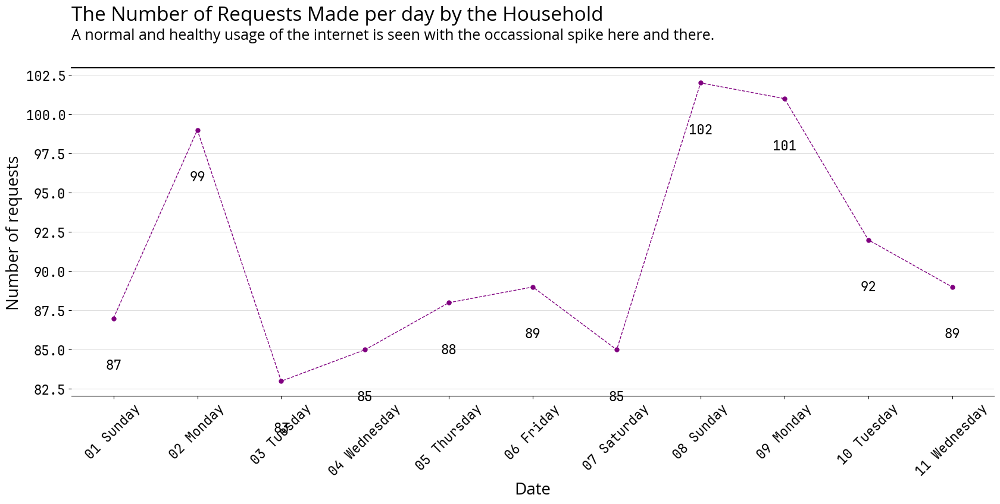

### Daily Usage - DOS Attack

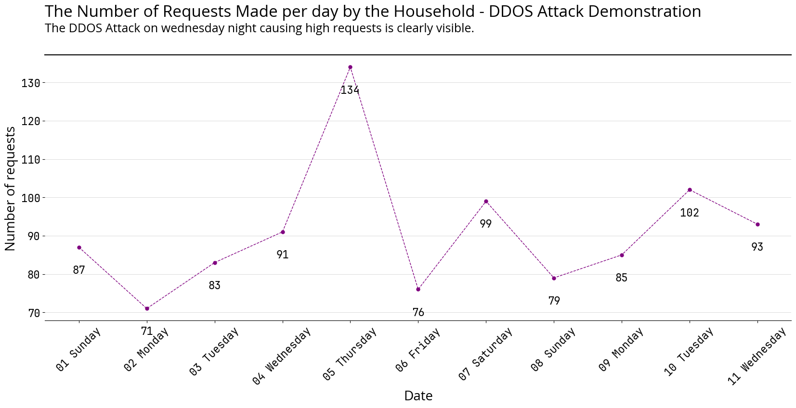

## Brute Force Attack Data

### Hourly Usage - Normal Usage

### Hourly Usage - Brute Force Attack

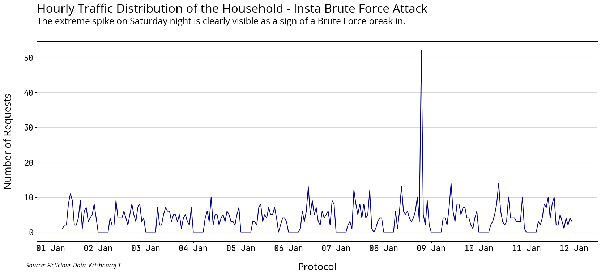

### Daily Usage - Normal Usage

### Daily Usage - Brute Force Attack

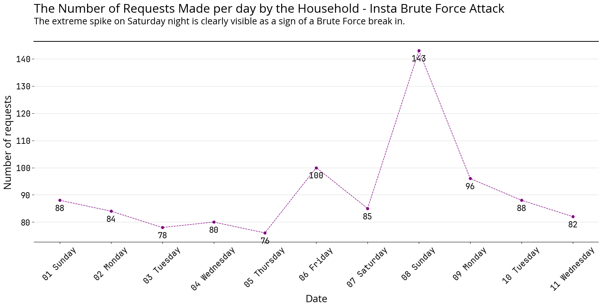

### Websites Visited - Normal Usage

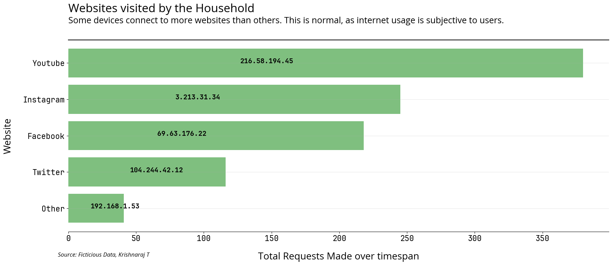

### Websites Visited - Brute Force Attack

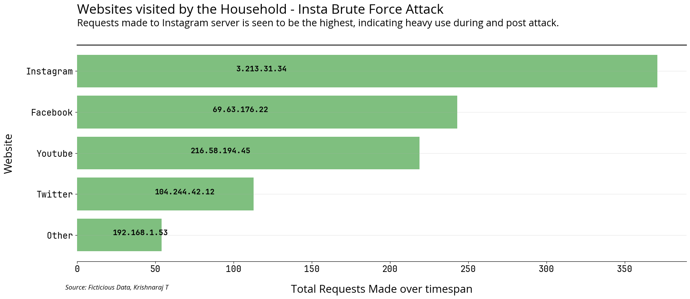

## Port Scanning Data

### Ports Used - Normal Usage

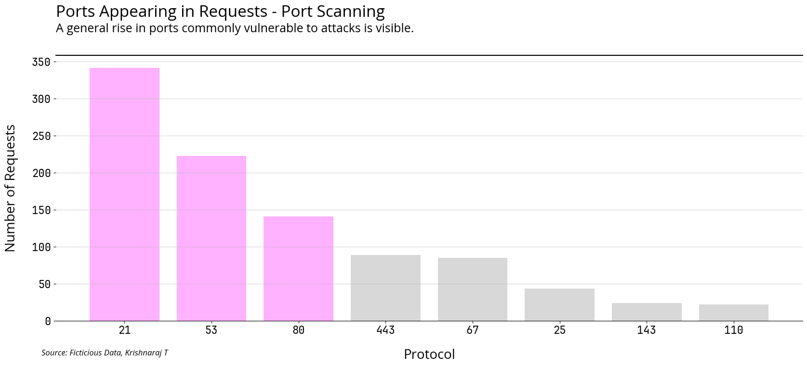

### Port Usage - Port Scanning Attack

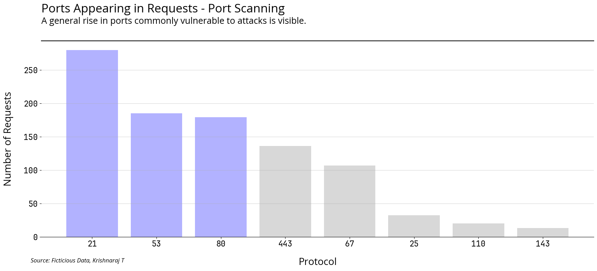

### Daily Usage - Normal Usage

### Daily Usage - Port Scanning Attack

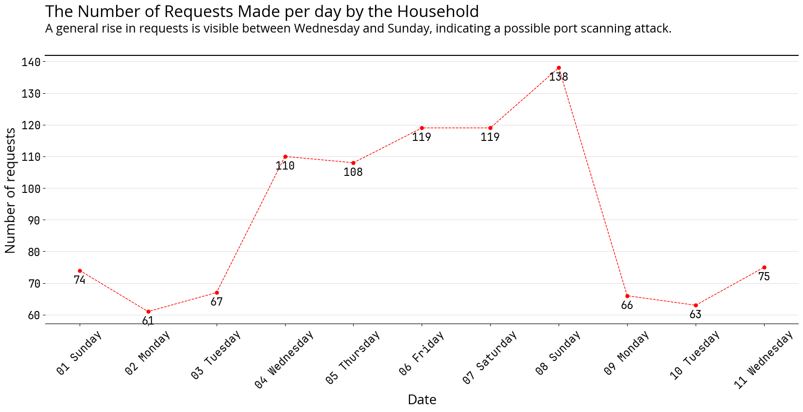

# Credits

[This amazing article on Towards Data Science by Bradley Stephen Shaw](https://towardsdatascience.com/make-your-charts-look-glorious-9ce3fa310b70)